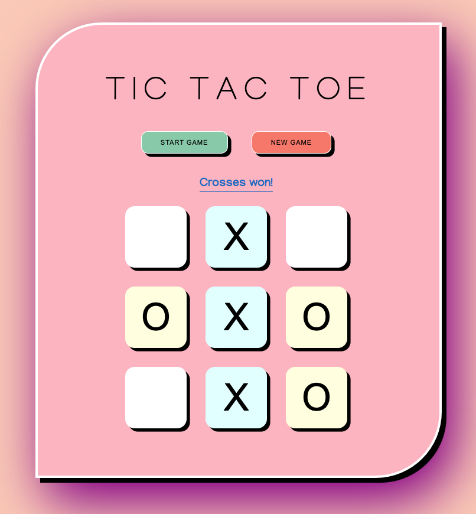

# Tic Tac Toe Game
## README
### Overview
This Tic Tac Toe game can be accessed here https://shell111.github.io/tic-tac-toe/
+ It is constrained to two players on the one device 
+ The game is set up as a 3 by 3 grid
+ The game is won by one player achieving there marker (X or O) in a row, column or diagonal
+ Players are allocated either the X or O to use by the game at the game start (this cannot be chosen at the moment). 
+ Players then take alternating turns until game is won or it's a draw.
+ Once the game is over, a pop up will display the result.
+ At this point the game can be reset by either the New Game or Restart Game button, and a new game can begin. 
+ Game reset is not an auto feature this point, it must be reset by either the New Game or Restart Game button
+ The game board is limited to 9 moves.

Game was written in HTML, CSS, and JS, with interaction by DOM manipulation

Developed and tested for use in Google Chrome Version 90.0.4430.93

Game URL: https://shell111.github.io/tic-tac-toe/

## Technologies used
+ HTML
+ CSS
+ JavaScript  
+ DOM manipulation

## Planning
+ Initial UI wireframe
+ Pseudo code planning
+ Initial code development to determine which approach would be taken - i.e. arrays, IF ststatements

## Design
+ Figma for the UI wireframe and initial design

## Future updates
+ Code to be refactored to be scalable 
+ Options for users to choose their X or O, or input their own avatars or markers
+ Game reset to automatically happen after a specified time period instead of manual reset by button
+ Multiple player options to be developed
+ Responsive design still to come

## Bugs
+ Empty cells to not be clickable once game win is determined

## Screenshot of interface

